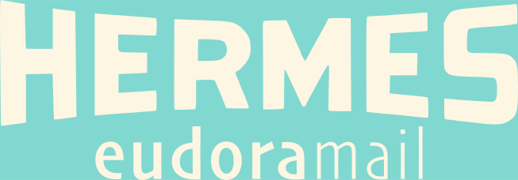
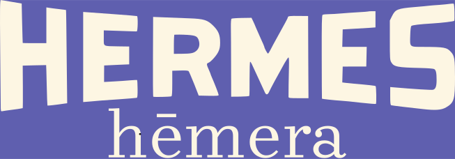
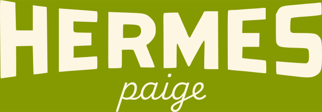
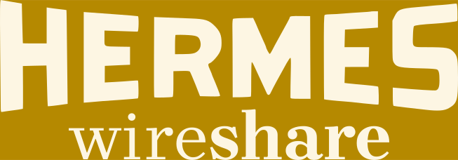
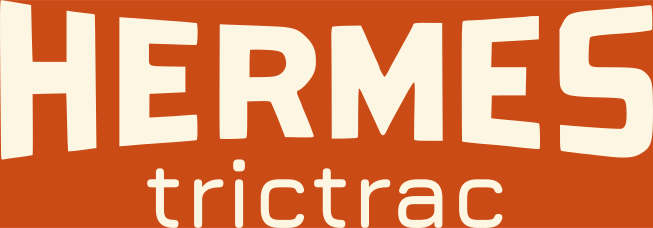
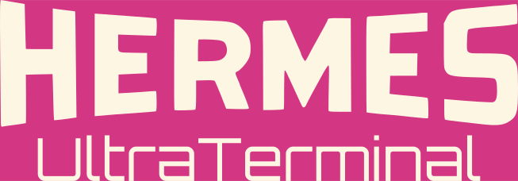
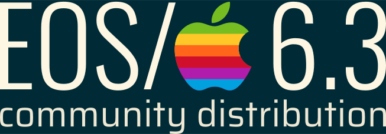

# Welcome!

HERMES is a Canadian company established in 2018 to research and develop a worthy successor to the cult-classic Eudora 7 mail client developed by QUALCOMM. Notwithstanding the coronavirus pandemic, we persisted, eventually expanding our offerings to encompass a Gnutella and BitTorrent servent (combined server and client) in Java, a computer game in Elixir, and a text-editing toolkit in C.

**If you are a new customer, please direct your purchase [here](https://buymeacoffee.com/eudoramail); our previous order page is no longer active. For a retrospective of the factors that led to our extended unavailability, as well as some insights on how this can be prevented in future, see [this link](./fond.html).** 

# Our Products

## Eudoramail for Windows

**NOTE: Eudoramail 8.0 is sold through a pay-what-you-want scheme; it can be yours for as little as a dollar (we suggest an inflation-adjusted price of $90). Purchase it [here](https://buymeacoffee.com/eudoramail) by sending “support” for any amount (though this is *not* a donation—it’s a contract of sale, subject to all applicable laws in the Dominion of Canada). Be aware that the software is sent out in monthly batches and we are not responsible if you make your purchase and have to wait.** 

Steve Dorner, former principal engineer at Qualcomm, once said: “The creative part of writing software is figuring out the real problem people are trying to solve and the best way to solve the problem, which is not always the way they suggest.” The context for this assertion is telling. Dorner said this during a post-mortem (figuratively speaking) of the software package that singlehandedly put his name on the wall: a piece of computer code which, in the IT environment of the late 1980s, became *synonymous* with modern desktop computer e-mail as we still tend to think of it to-day.

John Noerenberg, project manager at the time, describes the process: “The style of the company was to put an MS-DOS or Macintosh computer on each employee’s desk—whichever most suited their needs and their personal preference. We required e-mail software that was internet-savvy and platform agnostic. There wasn’t anything commercially available that satisfied either of those goals, much less both.” According to Dorner, “The internet was a growing and burgeoning place, but e-mail was really not established on the desktop computers that people were using at the time. It was something that you logged into some mainframe system to do, and with the ease-of-use that the desktop operating systems brought, that just wasn't the right way for people to do e-mail anymore.”

The result of these efforts, ushered forward by the so-called personal computer revolution, was Eudora for Macintosh. Granted, even in a vacuum empty of financial or management decisions, Eudora for Mac would unavoidably be rendered technologically obsolete (as “dead code”) for reasons not of QUALCOMM's making. Eventually, Noerenberg, Jeff Buckley, and other QUALCOMM employees would, without Dorner’s involvement, write new code in a different language that copied on Windows roughly what Eudora for Mac did, and followed, in a way close enough for government work, Eudora for Mac workflows—and this they called by the same name as the Mac product. **This** code, however, would **never** be obsolete in that way—even if development stopped for 10 years, as it did in 2005 amid the shifting sands of QUALCOMM’s corporate priorities, the last version of the source code could always be edited by the next company that picked up development (provided of course that the business realities worked out that way). Thus were the seeds for HERMES Eudoramail planted, as well as for its Haiku port, Hemera.

But what is Eudoramail, really? In short, it is the *ultimate* mail client. Yes, that is a subjective evaluation—it’s **our** opinion as to what our product is worth—but no less than Steve Wozniak seems to agree. In his words, Eudora “has an incredible feature that every single mail client should have.”  He continues:

> Any feature in the menu list, any action there, can be added as a button. I changed it so I have a vertical menu bar, so I can have tons and tons of pre-made buttons saved right where I want them up top, and I learn where those place are. You can script actions to the buttons, too, so I can quickly copy messages to my assistants. There are scripts I wrote for joke lists so I can forward a message, remove the brackets and formatting, and make sure all the original attachments are included, to a pre-defined ‘joke’ group. Apple’s Mail app just isn’t scriptable enough to really handle my mail buttons.
>
> Some of the buttons will re-direct mail with quote marks, or not. I’ve got another script that will actually customise a mail-forward, like my own version of mail merge. So even if something’s going out to 400 people, I can set it to single out certain people and take away all the forwarding markings, so it looks like I singled out someone to send them mail, which is, I hope, a nice little moment for them.

### Order here

**NOTE: Eudoramail 8.0 is sold through a pay-what-you-want scheme; it can be yours for as little as a dollar (we suggest an inflation-adjusted price of £55 Br., $70 Am., or $100 Cdn.). Purchase it [here](https://buymeacoffee.com/eudoramail) by sending a “donation” for any amount (though this is *not* really a donation—it’s a contract of sale, subject to all applicable laws in the Dominion of Canada). Be aware that the software is sent out in monthly batches and we are not responsible if you make your purchase and have to wait.** 

---

## Hemera for Haiku

It’s not a truth widely known, but HERMES Eudoramail isn’t original software. Rather, it’s a less-than-completely-faithful port (i.e. copy) of another package (Eudora for Mac, which survives in the Eos community distribution). Why not **completely** faithful? Because Eudoramail is architecturally an “MDI application”: it follows constraints dictated not by us, but by the MDI model itself, which was devised by Microsoft, is synonymous with a specific architecture and specific tradeoffs made at the jump, and results in a specific workflow. This model assumes, as a logical precondition, the existence of a *parent* window, and multiple *children*. Likewise, Eudoramail assumes a ‘hierarchical’ file system, such as the well-known NTFS, and structures its folder structure to behave well within those constraints.

If we wanted to port Eudoramail to another system, one with **different** assumptions, the naïve approach would have us import premises that aren’t relevant in the new environment except as imported assumptions. So we don’t do this. Instead, we write **for** the target. On the level of diagrams and flowcharts, Haiku is far more similar to Classic Mac than to Windows—so we should port directly from the Carbon source, right, since we have that? Wrong.

The underpinnings of Haiku assume stability at every turn. High-level, object-oriented languages like C++. Pervasive multithreading. Preëmptive multi-tasking. Metadata as a first-class file-system object, rather than encapsulated in something called a resource fork. And Haiku certainly doesn’t come with an all-singing, all-dancing toolkit that’s enough of a derivative of Carbon that the architecture can simply be transplanted *mutatis mutandis*. The engineering, after a fashion, is **much** more similar to Windows. Therefore, despite appearances, the Windows code **must** serve as our model—but on the interface between user and computer, the plan must embody most of the workflow that Classic Mac would impose.

Thus came the genesis of HERMES Hemera. It is a “mail user agent” (some might call it an e-mail client instead—both are correct) written specifically **for** Haiku, following Haiku’s fundamental assumptions and guidelines, and following a basic workflow patterned after Classic Mac, with a twist. Our target is not only power users (i.e. those who sit at their computer, open their inbox, and don’t close it until end of day) but also the corporate segment. In short, the desired result isn’t something that dovetails with a certain UNIXy “some assembly required” ethos, but a tool that can be present on the average employee’s Haiku notebook, and with which he can get to grips on the next business day. We believe this is something we have successfully achieved.

### Download

HERMES Hemera is currently available from our official [GitHub](https://github.com/nmatavka/hermes-hemera) page, or as a snapshot in the *Releases* section. We anticipate that it will shortly be available in binary form from *Haiku Ports*, the Haiku package manager.

---

## Paige

Apps that manipulate text in some form are *everywhere*; this does not mean only “text editors” *in sensu stricto*, but also things like word processors, Web editors, Markdown editors, desktop publishing apps, and even the message composer embedded in your eMail client (which, on a technical level, is nothing more than a Web editor of a highly specialised form).

If you are producing an app in that (very broad) category, you need a *text engine*. If your background is in development for Windows, you will most likely be familiar with `CRichEdit` from the Microsoft Foundation Classes; if, by any chance, you do not use `CRichEdit` in your project, you are most likely writing your own text engine from scratch or using a cross-platform toolkit (Qt or GTK).

**There is a fourth option:** a *turnkey* text engine—one that is oven-ready right out of the starting gate—can offer a developer experience very much like `CRichEdit`, but with many more features thanks to its specialised nature. Our text engine, called **Paige**, can cope with almost any task you throw at it, from Unicode to mail merge, with a comprehensive API specification over 500 pages in length, available in PDF and HTML format.

Moreover, Paige’s API is reasonably high-level, so you don’t need to grapple with pointless mathematical *minutiæ* and can readily and rapidly progress to the “meat and potatoes” of document editing, aided by the time-honoured Cartesian coördinate system.

With Paige, *the sky is the limit*. While we’d never condone using it to produce an HTML viewer (that’s a horror story all on its own), the trick could *undeniably* be turned, and of course Paige could certainly cope with browsing Geminispace (the difference lies less in the nature of the task than in the quality).

To prove the cross-cutting utility and adaptability that HERMES Paige offers the developer, we have employed it in two concrete applications, with plans to widen its use still further. It forms an integral part of both Eudoramail and Hemera, serving to compose as well as (optionally) to display e-mail messages.

### Download here

**HERMES Paige is *available now* from [our Git repository](https://github.com/nmatavka/HERMES-Paige) and is *fully* Open Source, with a manual available in [HTML](./PaigeManual.html) and [PDF](./PaigeManual.pdf) formats. Get it today!**

---

## WireShare

Arguably, WireShare was the first app we ever developed; in fact, it predates the founding of Team HERMES by many years, having seen its first version in 2010.

WireShare is a relatively difficult program to explain; in technical terms, it is a combined Gnutella and BitTorrent *servent*. Gnutella and BitTorrent are both ways for computers to transfer high-supply, high-demand files to each other. (Gnutella is older, but has certain advantages, such as a search function.) Because neither Gnutella nor BitTorrent make any distinctions between *server* and *client*, and people can and do serve files from their homes or offices, we call the type of file transfer that they do *peer-to-peer*. The advantage of this is *much* higher resilience; it’s naturally harder to take down a file that’s served from two hundred locations at once.

The problem, such as it is, is that peer-to-peer file sharing is abusable, and poor stewardship exacerbates any abuse. Prior to 2010, WireShare was known as LimeWire. Its corporate stewards, Lime Group LLC, were notorious for explicitly condoning abuse of the Gnutella network for violations of intellectual property law; inevitably, the Recording Industry Association of America took notice and filed suit, with the action being cited as *Arista Records LLC v. Lime Group LLC*. 

During negotiations, Lime Group introduced a backdoor into their product, and actioned it (disabling recent—but *not* older—versions of their software) subsequent to U.S. Federal Court Justice Kimba Wood’s order. Fortunately, Team HERMES is not a U.S. company; it is **proudly headquartered in Canada**, and in any case, the terms of the consent decree only apply to Lime Group LLC and the software known as LimeWire. We distribute **WireShare**. Whether it is, or is not, functionally and graphically identical to LimeWire is **immaterial**.

### Download

HERMES WireShare can be downloaded at our Git repository [here](https://github.com/nmatavka/hermes-wireshare); source code and Java binaries are currently provided, and this will expand to pre-bundled binaries for most commodity operating systems (macOS, Windows, Haiku, and various Linux distributions) in the fullness of time.

---

## Trictrac

Here at HERMES, we love tables games. If you don't know what a tables game is, the answer is simple: they’re all the games you can play on a backgammon board. It’s just too bad that people seem to think that there’s only **one** tables game worth playing: English backgammon. Those people are, to put it simply, wrong.

So we decided to fix the problem and introduce HERMES Trictrac, a free online game server that offers **six** tables games for the price of one: Backgammon (from Britain by way of Persia), Trictrac *à écrire*, *classique*, and *combiné*, as well as Toc (all from France), and Toccategli (from Austria). To this we have added a number of smaller, simpler variants, as well as a few experiments, in the hope that they may offer at least a few hours of enjoyment but without any guarantees.

Five of our headline six games form a category of their own in that, unlike almost all other tables games, they are not race games, where winning is binary and means getting the playing pieces ‘home’ after a fashion (off the board); instead, they are point-accumulation games with plural (differential) scoring, in which winning means getting a target score and scoring means arranging and maintaining the men in one of several named configurations. 

In case this sounds like impenetrable jargon, think of Rugby: there are multiple ways to score, each of which adds a different number of points to the total. In the five games here described, there are at least eight different ways to score, with varying point totals. These are subject to varying “wrappers”. For example, Trictrac *classique* is a bit like Lawn Tennis: twelve points make up one or two sets depending on whether a doubling flag is set to *on* or *off*, and winning twelve sets means winning the match.

The French board game of Trictrac is second only to Chess in its beauty and complexity; yet its equipment is among the most generic imaginable (a tables board as is used to play Backgammon, fifteen men per side, three coins, two Cribbage pegs, and a miniature flag) and its rules are, in a very real way, strictly algorithmic and computational—the phrase “clear, neat, and precise” can not but describe it perfectly. Unlike in partnership card games like Bridge or Quadrille, there is no “human factor” in Trictrac; nothing is negotiated, inferred, or socially mediated, and nothing is hidden, either. Every question or problem is soluble by resorting to the rules, and only the rules. This renders the game totally and utterly reducible to computer code (ideally, as it turns out, to event-driven Elixir code; never try to do this in JavaScript).

The other game is Backgammon (i.e. the binary race game *par excellence*, with roots in Persia by way of England). Here, the rules are the same as that of the broader Tables family: one has fifteen men, one moves them to a specific place, from there one moves them off the board, and the first to be completely off the board wins.

This is all a long way of saying that, though they share a game board and pieces, binary race games and point-accumulation games have essentially nothing in common (structurally, as implemented in computer code), and we wish to do justice to the latter family while also leaving something novel for fans of the former: thus, we have Plakoto and Pheuga (from the Ottoman Empire) as well as a rotation game that consists of Backgammon, Plakoto, and Pheuga in order, all of which are easy to learn and extremely satisfying for a race-game lover, as well as the five games we already mentioned, which will doubtless put a smile on the face of any Trictrac devotee.

For some simple examples of our nonstandard race games: Pheuga (also known by its French name, Jacquet) has restricted movement (one piece, the *Courier*, must be borne off first), the pieces move in *parallel* (Black moves “backwards” compared to Backgammon), and there is no hitting. Plakoto (also known by its Bulgarian name, Tapa, or by its Arabic name, Mahbousa) has pinning in place of hitting (sitting on a blot prevents it from moving), and the pieces move in parallel. Tavli is Backgammon, Plakoto, Pheuga on loop until someone gets five, seven, or nine points.

That said, the **canonical** games we support are, and will ever remain, the national Tables games of Great Britain and of France: Backgammon, Trictrac *classique*, *à écrire*, *combiné*, Toc, and Toccategli.

### Download and Play

You can play the games at [https://trictrac.hermes.cx](https://trictrac.hermes.cx). It’s free—give it a shot!

The source code for HERMES Trictrac can be downloaded at our Git repository [here](https://github.com/nmatavka/hermes-trictrac). This is an *online service* for those who understand how to deploy an Elixir stack; we recommend [fly.io](https://fly.io) and [Gigalixir](https://gigalixir.com) as the deployment services of choice. The rules of Trictrac (the game, rather than our implementation) can be found [here](./trictrac.pdf) in multilingual format (Danish, German, Swedish, and French).

---

## UltraTerminal

UltraTerminal is a flexible, efficient client application for connecting PC users on Microsoft Windows with remote services. Other than limited legacy or sector-dependent use cases (see below), these services fall into two general buckets: for communication with mainframes (such as those running the [IBM i](https://www.ibm.com/it-infrastructure/power/os/ibm-i) operating system, as well as its predecessors OS/400 and i5/OS), the **IBM 3270** and **IBM 5250** standards are used, which deliver a screen at a time in a fill-in-the-blank (*block mode*) format much like that of paper forms; and for communication with UNIX and Linux servers, as well as more broadly, use is made of the **HP VT100** and **HP VT220** *de facto* standards, which are character-addressable (more like a text-only computer program).

Unlike some other apps in this market segment, we offer full support for telephone (traditional modem), telnet, and ssh connexions, without undue fussing with external software; this is particularly useful where ssh3270 and ssh5250 are concerned, due to the type of services that are often run through such links, as well as the lack of reasonably-priced alternatives that integrate ssh tunnelling.

UltraTerminal also supports, or plans to support, these other types of connexions:

* **Viewdata (e.g. Prestel) — primarily used by the British travel industry**
* **Teletel (e.g. Minitel)**
* CompuServe
* SCO ANSI
* HP VT102
* ADDS Viewpoint
* ADM3A
* Data General DG210/DG211
* Televideo TV910/TV912/TV920/TV925/TV950
* Wyse 50/60

### Download/Purchase

**The source code for HERMES UltraTerminal can be downloaded at our Git repository [here](https://github.com/nmatavka/hermes-ultratrm); please take note, however, that the public source tree may, at times, appreciably lag with respect to the Windows binaries. We distribute the official version of the Windows binaries to our Eudoramail clients. If you wish to purchase, please do so by contributing a “donation” for any amount (though this is *not* really a donation—it’s a contract of sale, subject to all applicable laws in the Dominion of Canada). We suggest an inflation-adjusted price of £55 Br., $70 Am., or $100 Cdn.  Be aware that the software is sent out in monthly batches and we are not responsible if you make your purchase and have to wait.**

---

## Eos (formerly Eudora for Macintosh)

As of 2 April 2026, we finally did it: a compilable, fully Open Source successor to Eudora 6.2 for Mac is now in the wild. For more than one reason, *this is a big deal*, subject to certain caveats (about which more later).

Firstly, **archival**: older Macintosh apps used a feature called a *resource fork*, which included, at a minimum, things like text strings and icons. When transmitting Classic Mac source code over the Internet or on flash drive, resource forks could get corrupted or destroyed, leading to an inability to compile the product at all—unless the code was bundled using an archiver that **knew about resource forks**, such as StuffIt or BinHex. Tarballs (as common on later, UNIX-based Macs) or WinZip would strip resource forks deterministically and by design. The Eudora for Mac source code came to us with all the resource forks accidentally dummied out and unrecoverable, without **significant** effort. That effort has now been made.

Secondly, **holes**: the source code provided to us extended only to QUALCOMM’s intellectual property, not the intellectual property of others that they used with permission. This issue structurally parallels our experience with Eudora 7.1.0.9 for Windows (if anything, it’s neater) so we shan’t go into our solution of it here, but it **has** been solved (not rhetorically—factually).

Thirdly, **toolchain**: the QUALCOMM team historically used CodeWarrior as their integrated development environment, as common practice prior to 2004, while Apple development since then has almost universally relied heavily on Xcode. The master files that defined how the project was to be built had to be migrated.

In short, the process of establishing a *reasonably* modern build path demanded a vast amount of time and effort, which had to be abstracted from other parts of the project. The result is Eos 6.3, a Macintosh-first e-mail client that compiles on Xcode 9.4.1 under macOS X High Sierra and runs on Intel Macs running macOS X Mojave.

That said, this project does introduce a number of caveats, all tied to a number (!) of significant transitions undertaken by Apple in the last 20 years. Let’s unpack them.

1. **Carbon/C *vs* Cocoa/Objective-C**. The big, and glaring, issue is that Apple’s compatibility toolkit, to make Classic Mac apps able to run on macOS X without modification, runs on a stack of C, Carbon, and 32-bit Intel, while modern macOS X apps run on a stack of Objective-C, Cocoa, and 64-bit Arm. 
2. **Static non-progression**. Because the Carbon stack has reached “the end of the road” as it were, the current release likewise represents the last hurrah for this codebase in its present form. The app is *currently* usable as a mail client; its *future*, on the other hand, leaves certain questions needing to be answered. **We are not, however, contemplating an end-of-life scenario.**
3. **Incompatibility with strictly modern environments**. As it stands now, the app will not run on any Arm system, nor will it run on any Intel system running macOS X Catalina or newer. It will not compile on any Intel system running Mojave or newer. This is a *relative improvement*; Eudora for Mac 6.2.4 would not run on any Intel system running macOS X Snow Leopard or newer.
4. **Negligible commercial prospects**. By definition, application software written using an obsolete software stack (Carbon, C, 32-bit) to run on an obsolescent architecture (Intel, Mojave or older) is not salable according to ordinary business logic. The fact that it is being requested, explicitly and frequently, by our customers nonetheless implies the existence of an X factor or “special sauce”.

With **all of this** in mind, the decision was taken to provide the new, yet obsolete Eos 6.3 to our loyal clients, along with all necessary support until such time as a final decision is made, hand-in-glove with stakeholder interests, on a roadmap charting out the form of the future Eudoramail for Macintosh.  ***We are not contemplating the prospect of sunsetting the product at this time.*** Rather, we understand that product planning will necessarily involve choosing trade-offs, and this must not be done where the sun does not shine.

Partly because of the obsolescence of this codebase, and our interest in software preservation in a *usable* form, we have a fully open Eos repository. We make no claim on this project as our intellectual property; it is available strictly *pro bono publico*, although we do provide support and aim to use it as a springboard for our Macintosh product.

### Download

**You may download the Eos codebase [here](https://github.com/nmatavka/HERMES-Eos) and, if you wish, contribute to it. **

## Links

* For assistance in setting up OAuth2 with Eudoramail, please visit [oauth2.html](./oauth2.html) on this server.
* For the complete Paige manual, please visit [paigemanual.html](./paigemanual.html) on this server.
* The Paige manual is also available as a PDF [here](./paigemanual.pdf).
