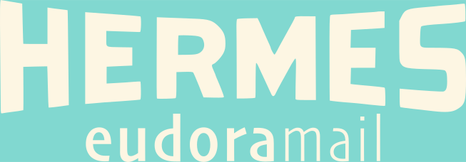

# Welcome!

HERMES is a Canadian company established in 2018 to research and develop a worthy successor to the cult-classic Eudora 7 mail client developed by QUALCOMM. Notwithstanding the coronavirus pandemic, we persisted, eventually expanding our offerings to encompass a Gnutella and BitTorrent servent (combined server and client) in Java and a text-editing toolkit in C.

# Our Products

## Eudoramail

**NOTE: Eudoramail 8.0 is sold through a pay-what-you-want scheme; it can be yours for as little as a dollar (we suggest an inflation-adjusted price of $90). Purchase it [here](https://igg.me/hermes80/) by sending a "donation" for any amount (though this is *not* really a donation—it's a contract of sale, subject to all applicable laws in the Dominion of Canada). Be aware that the software is sent out in monthly batches and we are not responsible if you make your purchase and have to wait.** 

Our signature product, Eudoramail, is a rebuild of Eudora 7 for Windows as written by QUALCOMM, with language and security modifications to make it friendly for the modern, *internationalised* office environment, one where *security* is a paramount consideration. 

If you *don't* know what Eudora is, due to having grown up on the Internet post-2006, *Tedium*'s Ernie Smith has a [fascinating write-up](https://tedium.co/2017/09/28/eudora-email-history/) headlined "A Eulogy for Eudora" which, although it predates the release of our software in 2022, furnishes a useful retrospective on why Qualcomm's iteration of the software was ultimately pulled from the market and particularly on what made it so attractive to its customers.

In short, in the words of Steve Wozniak, in an interview he did with [Lifehacker](https://lifehacker.com/how-apple-co-founder-steve-wozniak-gets-things-done-5222989): Eudora "has an incredible feature that every single mail client should have.

"Any feature in the menu list, any action there, can be added as a button. I changed it so I have a vertical menu bar, so I can have tons and tons of pre-made buttons saved right where I want them up top, and I learn where those place are. You can script actions to the buttons, too, so I can quickly copy messages to my assistants. There are scripts I wrote for joke lists so I can forward a message, remove the brackets and formatting, and make sure all the original attachments are included, to a pre-defined 'joke' group. Apple's Mail app just isn't scriptable enough to really handle my mail buttons.

"Some of the buttons will re-direct mail with quote marks, or not. I've got another script that will actually customize a mail forward, like my own version of mail merge. So even if something's going out to 400 people, I can set it to single out certain people and take away all the forwarding markings, so it looks like I singled out someone to send them mail. Which is, I hope, a nice little moment for them."

While the topic of security is too complex to discuss on this page, **in general**, eMail servers will deny connexion to a non-conforming client, rather than continuing with an insecure mode of communication. This caused some problems in the early days, before Eudoramail 8 even saw the light of day—problems such that the product would not be salable except to power users who were prepared to make the sacrifice of simplicity and ease of use. Worse, since then and continuing to the present, it has become obvious that electronic protective measures are not a fix-and-forget deal; they demand *maintenance* and *ongoing* revision. In short: security delayed is security denied!

The upshot of this is that, ever since May 22, 2018, when Computer History Museum curator Leonard J. Shustek released the [Eudora™ Email Client Source Code](https://computerhistory.org/blog/the-eudora-email-client-source-code/), we have been shoring up Eudora's EPM's, even *predating* the launch of our product. According to Andrew Orlowski at [The Register](https://www.theregister.com/2018/05/23/finally_historic_eudora_code_goes_open_source/): "Under this latest deal, Qualcomm is to donate all IP – copyright code, trademarks and domain names – over to the museum. The code is released under a BSD licence with an agreement to bundle the binary of RogueWave's 20-year-old MFC library (for non-commercial use)."

It may be remarked that Eudoramail 8.0 had a protracted development cycle by most people's standards: "clean compilation of the main Eudora/Hermes executable" (but without linking to libraries) was achieved on [19 July 2019](./primarysource1.pdf), while [31st March 2022](./primarysource2.pdf) saw "source code that compiles, links with the Stingray library, runs, and does not immediately crash". The initial public prototype (or *alpha*) was distributed on [1 August 2022](./primarysource3.pdf), with at least twenty-six subsequent alphas distributed since then.

Although originally intended as an open-source project in the conventional sense (with everyone being able to participate in development), there are serious technical reasons that this is not the case, and potentially will not be in the medium-term; instead, it might best be described as [fair-source](https://techcrunch.com/2024/09/22/some-startups-are-going-fair-source-to-avoid-the-pitfalls-of-open-source-licensing/) (i.e. source-available with caveats). Mr Orlowski highlights one of these reasons: compilation relies on [Stingray](https://www.perforce.com/products/stingray), which went through a whole chain of acquisitions—first Rogue Wave, then QuovadX, and finally Perforce—and the binary is not enough; source code access is required. Compiling Eudoramail also demands Wintertree Software's [Sentry Spelling Checker Engine](https://www.wintertree-software.ca/dev/ssce/source/index.html); although this is available as a dynamic-link library, our sense of ethics as an organisation will not allow us to pursue any route other than full source-code access. Finally, Eudoramail also relies on HERMES Paige—but that doesn't really count, since it's *our* rich-text library, and we produce it as an Open Source project in its own right. **In short, Perforce prices Stingray's source code at $3,600 per person. Wintertree prices Sentry's source code at $5,000 per person. Development *demands* periodic compilation, meaning that each developer would need these libraries.** While Sentry is slated to be replaced with a free solution, it would be contrary to all common sense to pursue the Open Source workflow for Eudoramail right now.

**NOTE: Eudoramail 8.0 is sold through a pay-what-you-want scheme; it can be yours for as little as a dollar (we suggest an inflation-adjusted price of $90). Purchase it [here](https://igg.me/hermes80/) by sending a "donation" for any amount (though this is *not* really a donation—it's a contract of sale, subject to all applicable laws in the Dominion of Canada). Be aware that the software is sent out in monthly batches and we are not responsible if you make your purchase and have to wait.** 

## Paige

Apps that manipulate text in some form are *everywhere*; this does not mean only "text editors" *in sensu stricto*, but also things like word processors, Web editors, Markdown editors, desktop publishing apps, and even the message composer embedded in your eMail client (which, on a technical level, is nothing more than a Web editor of a highly specialised form).

If you are producing an app in that (very broad) category, you need a *text engine*. If your background is in development for Windows, you will most likely be familiar with `CRichEdit` from the Microsoft Foundation Classes; if, by any chance, you do not use `CRichEdit` in your project, you are most likely writing your own text engine from scratch or using a cross-platform toolkit (Qt or GTK). 

**There is a fourth option:** a *turnkey* text engine—one that is oven-ready right out of the starting gate—can offer a developer experience very much like `CRichEdit`, but with many more features thanks to its specialised nature. Our text engine, called **Paige**, can cope with almost any task you throw at it, from Unicode to mail merge, with a comprehensive API specification over 500 pages in length, available in PDF and HTML format.

Moreover, Paige's API is reasonably high-level, so you don't need to grapple with pointless mathematical minutiae and can readily and rapidly progress to the "meat and potatoes" of document editing, aided by the time-honoured Cartesian coördinate system.

With Paige, *the sky is the limit*. While we'd never condone using it to produce an HTML viewer (that's a horror story all on its own), the trick could *undeniably* be turned, and of course Paige could certainly cope with browsing Geminispace (the difference lies less in the nature of the task than in the quality).

**Paige is *available now* from [our Git repository](https://github.com/nmatavka/HERMES-Paige) and is *fully* Open Source, with a manual available in [HTML](./PaigeManual.html) and [PDF](./PaigeManual.pdf) formats. Get it today!**

## WireShare

Arguably, WireShare was the first app we ever developed; in fact, it predates the founding of Team HERMES by many years, having seen its first version in 2010.

WireShare is a relatively difficult program to explain; in technical terms, it is a combined Gnutella and BitTorrent *servent*. Gnutella and BitTorrent are both ways for computers to transfer high-supply, high-demand files to each other. (Gnutella is older, but has certain advantages, such as a search function.) Because neither Gnutella nor BitTorrent make any distinctions between *server* and *client*, and people can and do serve files from their homes or offices, we call the type of file transfer that they do *peer-to-peer*. The advantage of this is *much* higher resilience; it's naturally harder to take down a file that's served from two hundred locations at once.

The problem, such as it is, is that peer-to-peer file sharing is abusable, and poor stewardship exacerbates any abuse. Prior to 2010, WireShare was known as LimeWire. Its corporate stewards, Lime Group LLC, were notorious for explicitly condoning abuse of the Gnutella network for violations of intellectual property law; inevitably, the Recording Industry Association of America took notice and filed suit, with the action being cited as *Arista Records LLC v. Lime Group LLC*. 

During negotiations, Lime Group introduced a backdoor into their product, and actioned it (disabling recent—but *not* older—versions of their software) subsequent to U.S. Federal Court Justice Kimba Wood's order. Fortunately, Team HERMES is not a U.S. company; it is **proudly headquartered in Canada**, and in any case, the terms of the consent decree only apply to Lime Group LLC and the software known as LimeWire. We distribute **WireShare**. Whether it is, or is not, functionally and graphically identical to LimeWire is **immaterial**.

**There are two minor snags: firstly, because of some deprecated code, many mouse-click events (such as dialogue boxes that open on click) don't occur on Macintosh, and secondly, the entire BitTorrent system doesn't function on at least Mac and Linux. We will not distribute the software in such a state, so until this is fixed, watch this space!**

## Links

* For assistance in setting up OAuth2 with Eudoramail, please visit [oauth2.html](./oauth2.html) on this server.
* For the complete Paige manual, please visit [paigemanual.html](./paigemanual.html) on this server.
* The Paige manual is also available as a PDF [here](./paigemanual.pdf).
